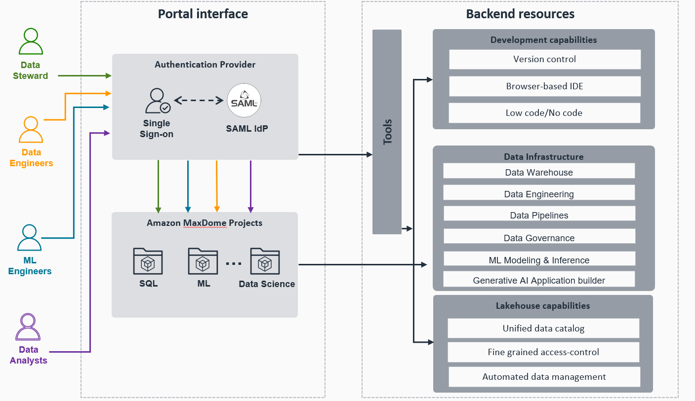
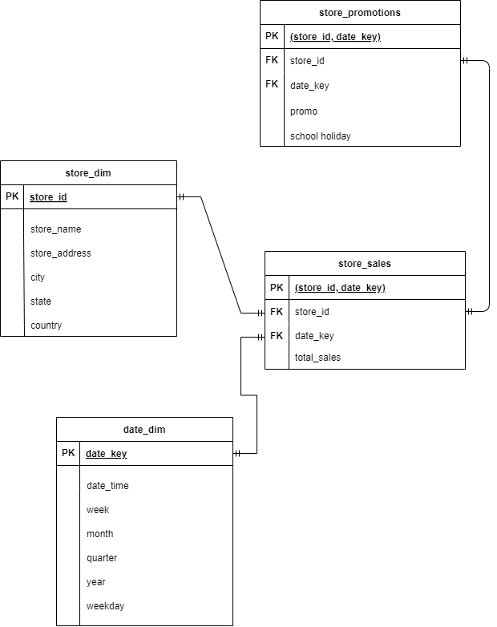
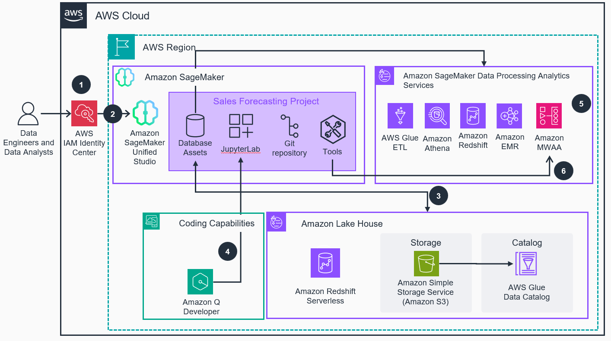
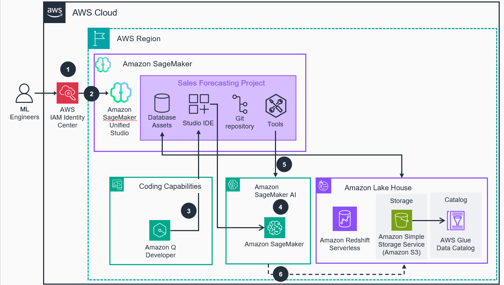

# Guidance for a Unified Development Experience for AWS Data, Analytics, and Machine Learning with Amazon Amazon SageMaker Unified Studio

## Table of Contents

1. [Overview](#overview)
    - [Cost](#cost)
1. [Prerequisites](#prerequisites)    
1. [Deployment Steps](#deployment-steps)
1. [Running the Guidance](#running-the-guidance)
    - [Administrator](#administrator)
    - [Data Engineer](#data-engineer)
    - [ML Engineer](#ml-engineer)
1. [Next Steps](#next-steps)
1. [Cleanup](#cleanup)
1. [FAQ, known issues, additional considerations, and limitations](#faq-known-issues-additional-considerations-and-limitations-optional)
1. [Revisions](#revisions-optional)
1. [Notices](#notices-optional)
1. [Authors](#authors-optional)

## Overview

This guidance illustrates a use case where two different user roles (user personas) collaborate on different tasks related to the Data and AI model development lifecycle which includes data ingestion, data analytics, and further use of that data to create an artificial intelligence (AI) model using AWS services all within one single environment.

This two user personas will be collaborating using Amazon SageMaker Unified Studio. Amazon SageMaker Unified Studio is a unified development experience that brings together AWS data, analytics, artificial intelligence (AI), and machine  learning (ML) services. It provides a place to build, deploy, execute, and monitor end-to-end workflows from a single interface.

### User types in SageMaker Unified Studio

In SageMaker Unified Studio there are two different types of users, administrators and users:

#### Administrators

These users have access to the SageMaker Unified Studio console which is available via the AWS console to create organizing entities called domains and manage user access to those domains. Administrators can also review what tools and services are set up for use within those domains. By providing access to a domain, you provide access to multiple tools at once and facilitate user auditing and collaboration.

#### Users

These are the end users that will use SageMaker Unified Studio's development experience to work on business use cases, for this guidance use case. We will implement the flow of two different users (Data Engineer and ML Engineer). They will use the tool integrations in a domain to create a ML model for sales forecasting. We will detail each user responsibilities, tasks and how they will be interacting with SageMaker Unified Studio console.

As mentioned earlier, Amazon SageMaker Unified Studio provides two different console experiences the SageMaker Unified Studio console and the SageMaker Unified Studio portal, these main differences between both are:

### Console experiences in SageMaker Unified Studio

#### SageMaker Unified Studio console

The Amazon SageMaker Unified Studio console is accessible from the AWS console. This console is where you can create and manage the organizational frameworks for each project workspaces. It displays information for domains, project profiles, and environment blueprints. You can also manage user access using the SageMaker Unified Studio console after you have created an IAM Identity center group.

#### SageMaker Unified Studio portal

The Amazon SageMaker Unified Studio portal is a workspace console that users access with a link from their admins. Users can build, deploy, and manage projects in the portal. This portal provides access to various tools and services, including a query editor, JupyterLab IDE, SageMaker machine learning models, and more.

### Organizational entities in SageMaker Unified Studio

In addition to all of the above, Amazon SageMaker Unified Studio provides two additional organizational entities for assets, the domains and projects.

#### Domain

A domain is an organizing entity created by an administrator user. Then administrators assign users to existing domains so that users can collaborate using the tools, assets, and resources available in that domain. A domain can represent a business organization or a business unit within an organization that contains people who might want to collaborate and share resources. An administrator creates a domain and shares the portal URL assigned to that domain with the users.

#### Project

A project is a boundary within a domain where users can collaborate on a business use case, for this particular guidance, the different users assigned to the project will be working on creating ML model to forecast sales. Within projects, users can create and share data, computing, and other resources. When a user is added to a project, they gain access to relevant files and tools within that project, such as resources to create and deploy machine learning models. They can create new files and resources for the project, manage existing resources, share work with other users on the same project, and add other users to the project

Find below a high-level diagram of the how different users interact with SageMaker Unified Studio:



### Cost

_You are responsible for the cost of the AWS services used while running this Guidance. As of <month> <year>, the cost for running this Guidance with the default settings in the <US East (N. Virginia)> is approximately $2.000 per month assuming that provisioned/serverless capacity is running 4 hours a day with months with 22 working days (this is 4hrs x 22 days)._

Below you can find a  cost breakdown for this estimate  based on the resources this guidance runs and assuming the aforementioned working periods (22 days a month with 4 hours per day).

Its important to mention SageMaker Unified Studio doesn't have any cost associated and you are only charged for the underlying services it uses. For this guidance purposes there are basically three:

* Redshift Serverless (8 DPUs base capacity), make sure you have decreased this value as instructed on the [administrator (steps 13 and 14)](#administrator)for monthly cost we assume 1hr of active use of the cluster use per day.
* SageMaker Studio instance (ml.t3.xlarge) with 16 GB of EBS storage.
* SageMaker EndPoint.
* S3 storage.

_We recommend creating a [Budget](https://docs.aws.amazon.com/cost-management/latest/userguide/budgets-managing-costs.html) through [AWS Cost Explorer](https://aws.amazon.com/aws-cost-management/aws-cost-explorer/) to help manage costs. Prices are subject to change. For full details, refer to the pricing webpage for each AWS service used in this Guidance._

### Sample Cost Table

The following table provides a sample cost breakdown for deploying this Guidance with the default parameters in the US East (N. Virginia) Region for one month.

| AWS service  | Dimensions | Monthly Cost [USD] |
| ----------- | ------------ | ------------ |
| Amazon Redshift | Base RPU (8), Expected daily runtime (hours) (1hr)  | $91.50 |
|SageMaker Studio Notebooks|Instance name (ml.t3.xlarge), Number of data scientist(s) (1), Number of Studio Notebook instances per data scientist (1), Studio Notebook hour(s) per day (4), Studio Notebook day(s) per month (22)|$17.6|
|SageMaker Real-Time Inference|Storage (General Purpose SSD (gp2)), Instance name (ml.m5.xlarge), Instance name (ml.c4.2xlarge), Number of models deployed (1), Number of models per endpoint (1), Number of instances per endpoint (1), Endpoint hour(s) per day (8), Endpoint day(s) per month (22)|$40.62|
|SageMaker Asynchronous Inference|Number of models per endpoint (1), Storage (General Purpose SSD (gp2)), Instance name (ml.m5.12xlarge), Number of models deployed (1), Number of instances per endpoint (1), Endpoint hour(s) per day (8), Endpoint day(s) per month (22), Storage amount (1 GB per month)|$486.78|
|S3 Standard|S3 Standard storage (1 GB per month)|$0.02|

## Prerequisites

In order to be able to run this guidance and to use SageMaker Unified Studio you need to have either:

a.  An [organization instance of IAM Identity Center](https://docs.aws.amazon.com/singlesignon/latest/userguide/get-set-up-for-idc.html), this is an instante in your [AWS Organization management account](https://docs.aws.amazon.com/organizations/latest/userguide/orgs-manage_accounts_management.html). This should be on the same region you plan to deploy the guidance, refer to [supported regions section](#supported-regions) for more details.

b.  An [account instance of IAM Identity Center](https://docs.aws.amazon.com/singlesignon/latest/userguide/account-instances-identity-center.html?icmpid=docs_sso_console) configured in any of your [AWS Organization's member accounts](https://docs.aws.amazon.com/organizations/latest/userguide/orgs-manage_accounts_members.html). This also needs to be created on the same region you plan to deploy the guidance, refer to [supported regions section](#supported-regions) for more details.

### Supported Regions

Only the following regions are supported for this guidance:

* eu-west-1
* us-east-1
* us-west-2

Deploying the guidance in other regions may lead to errors or inconsistent behavior.

## Deployment Steps

These are the deployment steps for this guidance. As SageMaker Unified Studio doesn't have yet public APIs most of the configuration needs to be in the console, refer to [administrator section for more details.](#administrator)

1. Clone the repo using command ```git clone guidance-for-a-unified-development-experience-for-aws-data-analytics-and-machine-learning```
1. Deploy the [CloudFormation template you can find on under deployment folder of this guidance.](deployment/sagemaker_us_guidance_network_setup.yaml). Remember to deploy only using CloudFormation in any of the [supported regions](#supported-regions) mentioned above. You can leave the `availabilityZones` parameter empty (default) or choose the AZs across which you want the VPC resources to span across.
1. Manually execute the steps you can find under [administrator section.](#administrator)
1. Manually execute the steps you can find under [Data Engineer section.](#data-engineer)
1. Manually execute the steps you can find under [ML Engineer section.](#ml-engineer)

## Running the Guidance

As mentioned earlier in this guidance we are showcasing a typical collaboration scenario where, a Data Engineer (John) who will be collaborating with a ML engineer (July) to create a ML model to forecast sales.

For this John will need to transform, load and clean three different csv formatted data-files that were provided by the store management department containing sales data about each of the stores along with the promotions applied to those sales. 

Then this resulting dataset will be used by July to build and train a model to forecast sales. And made it available for inference via a SageMaker inference endpoint.

These two users will be collaborating using Amazon SageMaker Unified Studio Portal, which provides a unified working environment allowing them to perform the tasks they need within a unified console experience.

At the moment of launch SageMaker Unified Studio doesn't have API, SDK or Cloudformation support so all the remaining steps of this guidance will be done from the console, once API support is added we will update the guidance to reflect it.

### Administrator

Although it is not present on the guidance architectural diagrams the SageMaker Unified Studio domains (organizing entity created in SageMaker Unified Studio to group projects) need to be created by an administrator user. 

This user will be responsible to provision the resources needed by SageMaker Unified Studio to initialize a domain that then can be used by the end users (or Data and ML engineers in this guidance).

For this task the Administrator **user must (at least)** have access to both the DataZone and SageMaker Unified Studio consoles in AWS, refer to the public documentation of these services to learn more about the IAM permissions needed for this user.

This user will be responsible to perform the following configuration steps:

1. Deploy the cloudformation `sagemaker_us_guidance_network_setup` template under [deployment folder](deployment/sagemaker_us_guidance_network_setup.yaml) of this guidance, this template creates the necessary VPC resources (subnets, Internet Gateways, routing tables, etc...) that allow SageMaker Unified Studio to operate with AWS services and resources.
1. [Enable IAM Identity Center](https://us-east-1.console.aws.amazon.com/singlesignon/home?region=us-east-1) in the region you want to use for SageMaker Unified Studio (this guidance will use us-east-1 as example). If you already have IAM IC configured you can skip this step.
1. Add users (and groups if needed) that will be accessing SageMaker Unified Studio portal experience
1. Access to the [DataZone console](https://us-east-1.console.aws.amazon.com/datazone/home?region=us-east-1#/createv2) and create a domain. If you have enabled IAM Identity Center in the previous step you will be able to use `Quick Setup` option with simplifies configuration.
1. Expand the `Quick setup details` on the bottom of the screen and select the following IAM roles for each of the configuration options, these should be already selected for you, note that role names _might be slightly different_ from the ones listed below:

|Section|Configuration option|IAM Role to Select|
|--------------------|--------------------|------------------|
|Domain resources|Domain execution role |SagemakerUSDomainExecutionRole|
|Domain resources|Domain Service role|SagemakerUSDomainExecutionRole|
|Data analytics and machine learning resources|Manage access role|SagemakerUSManageAccessRole|
|Data analytics and machine learning resources|Provisioning role|SagemakerUSProvisioningRole|
|Generative AI resources|Model provisioning role|SagemakerUSBedrockModelManagementRole|
|Generative AI resources|Model consumption role|SagemakerUSBedrockModelConsumptionRoleOneForAll|

6. (Optional) Only if you had any problems filling the roles on the earlier step you can deploy in CloudFormation the template [optional_sagemaker_us_guidance_IAM_roles_setup](deployment/optional_sagemaker_us_guidance_IAM_roles_setup.yaml) under the deployment folder of this guidance and retry the step, the all the roles as outlined in the table above should be present now.
6. On `Virtual private cloud (VPC)` section select **SageMakerUnifiedStudioVPC**, this is the VPC we have deployed with CloudFormation on [the deployment steps](#deployment-steps). When selecting the subnets just select the **private subnets** the aforementioned VPC has across your AZ's.
6. Once this information is complete click on the `Continue` button
6. On the next screen input one of the email addresses of the users you have created on step 3. This will be actually the first user of the domain you are about to create and will be added as an owner for the domain with full permissions over it.
6. Click on `Create domain` and wait for completion (typically ~5 minutes).
6. (optional) Once the domain is created select it from the list of available domains and click on the recently created domain, under the `User management` tab add the users you want to be able to access the SageMaker Unified Studio portal of this domain.
6. (optional) Under the `Application` tab click on `Actions -> Add`  to add Q Developer pro support on the JupyterLab experience for your domain ([charges apply](https://aws.amazon.com/q/developer/pricing/)). Also if you want you can edit after adding the connection to change it to the Free tier to avoid costs.
6. Under the `Project profiles` tab click on **Data Analytics and AI-ML Model Development** and then under the `Blueprint deployment settings` tab select **SageMaker Unified Studio RedshiftServerless** blueprint and click on `Edit`.
6. Select the `redshiftBaseCapacity` blueprint parameter and edit it order to change its value to 8. This change will set the RS serverless base capacity to 8 [RPUs](https://docs.aws.amazon.com/redshift/latest/mgmt/serverless-capacity.html) for all SageMaker Unified Studio projects allowing you to save on costs.
6. Now you are ready to click on the `Open data portal` button at the top right corner of the page to access the SageMaker Unified Studio portal experience and continue with the [Data engineer](#data-engineer) steps.
6. You will be redirected to the `Project list` section, create click on `Create Project` button and name it `SalesForecastingProject`. For the Project Profile select `Data Analytics and Al-ML Model Development` and click on `Continue`.
6. On the second step of the project creation enter a unique name for the `SageMaker Unified Studio LakeHouse Catalog`, for example *sales-forecasting-catalog* (make sure you are lowercase letters, numbers, underscores and hyphens for the value of this field).
6. Wait for the project to complete (this could take several minutes).
6. Once the project is created you should be redirected to the project overview page. Now click on the `Members` section you have on the left menu and add the IAM Identity Center users you have created for your Data Engineer and ML Engineer personas (you can omit this step if you want to run all the guidance with the same IAM IC user).
6. At the top center of the page you will find the _Project_ collapsible menu, expand the menu, select the `Compute` section and under the `Data Warehouse` tab make sure a *Redshift Serverless* compute is provisioned. You can provision more compute resources if needed for your project users at a later time.
6. Now you are ready to hand over the portal URL to your Data Engineer and ML Engineer to start working on the `SalesForecastingProject`.

### Data Engineer

John is a data engineer who needs to work on a set of files that contain store sales information [store_sales.csv](source/input_data/store_sales.csv), [store_promotions](source/input_data/store_sales.csv) and [date information](source/input_data/date_master.csv). 

Each file contains data that is related but it doesn't follow a STAR schema to be used in a RDMBs engine such as a DB or a DW:



Each data-file contain the following information:

* **Store sales** contain information the sales for a given store along with additional information about that store such as its name, address, etc..

* **Store promotions** include information about the promotions that were applied on a certain store and date.

* **Date** contains additional information about the date when a particular promotion was applied (this additional data-file was created for illustrative purposes).

At high level the data engineer needs to transform this data files to make it fit in a [STAR schema](https://en.wikipedia.org/wiki/Star_schema) to them be able to load it into a DW solution (Amazon Redshift) to join that data. To do this in  SageMaker Unified Studio he can follow this steps:

1. [In web Browser] Access SageMaker Unified Studio using the portal URL that was facilitated by the Administrator.
1. [In SageMaker Unified Studio portal] Choose the Sales Forecasting Project that the Administrator created for him.
1. [In SageMaker Unified Studio portal] On top level menu bar choose Build -> JupyterLab to connect to the SageMaker Unified Studio space.
1. [In JupyterLab] Create a folder named `input_data` under the root folder `/`.
1. [In JupyterLab] Create a folder named `scripts`.
1. [In JupyterLab] Upload the csv data-files under the guidance's repository [input_data](source/input_data/).
1. [In JupyterLab] Upload the scripts under [source/script/data-engineer/](source/script/data-engineer/) to the scripts folder created on step.
1. [In JupyterLab] Execute the script cell by cell to perform the data transformations using Spark, load the data to Redshift tables and then join the data using Redshift.

Using the Multi-language, Multi-compute Python kernel available in Amazon SageMaker Unified Studio all these steps can be performed from a single Jupiter Notebook without needing to switch between different Notebook experiences or SQL Editors.

#### Data engineer flow diagram

Below you can see a detailed flow diagram for the Data Engineer user and how SageMaker Unified Studio interacts with the different backend services in a transparent manner for the user allowing him to operate from a single console experience via the 



### ML Engineer

In the example illustrating this guidance July would be acting as the ML Engineer that has been tasked with creating a ML model to forecast sales based on the historical sales dataset that John (our Data Engineer has prepared).

July will use the data prepared and loaded into Data Warehouse (Redshift) to train a forecasting ML model using below steps.

1. [In SageMaker Unified Studio portal] On top level menu bar choose Build -> JupyterLab to connect to the SageMaker Unified Studio space.
1. [In JupyterLab] Create a folder named `ml-engineer` under `source/script` folder.
1. [In JupyterLab] Upload the scripts under [source/script/ml-engineer/](source/script/ml-engineer/) to the scripts folder created on step.
1. [In JupyterLab] Execute the script cell by cell to load data from Redshift to a DataFrame and train a ML model using Amazon SageMaker AutoML APIs.
1. [In JupyterLab] Amazon SageMaker Autopilot is used to train the model and generate predictions
1. [In JupyterLab] Process starts with customers getting data from Redshift and using for Model training
1. [In JupyterLab] Predictions can be generated in two ways: - Batch processing - Real-time endpoint
1. [In JupyterLab] During training: - Multiple time series models run concurrently - Models are combined into a single ensembled model - Ensemble blending minimizes forecast error 
1. [In JupyterLab] Customers receive: - Metadata  - Ensemble model - All underlying candidate models


#### ML engineer flow diagram

Below you can see the detailed flow diagram for the ML Engineer in this case using SageMaker Unified Studio to interact with the backend ML services and capabilities without needing to leave the SageMaker Unified Studio portal experience or log into the AWS console.



## Next Steps

This guidance only scratches the surface of what the unified console experience for SageMaker Unified Studio (a.k.a. SageMaker Unified Studio portal) allows to do. Other possible flows and functionalities that can be tested include, but are not limited to:

* Workflows orchestration (using [Amazon Managed Workflows for Apache Airflow (MWAA)](https://aws.amazon.com/managed-workflows-for-apache-airflow/))
* Visually create ETL flows using a LowCode/NoCode experience to ensure data is collected where it is originated and then transformed as needed before being ingested for further analytics or to be used for training/fine-tuning your ML/LLMs models.
* Use [Sagemaker's HyperPod](https://aws.amazon.com/sagemaker/hyperpod/) to reduce time training foundation models (FMs).
* Use [ML Pipelines](https://aws.amazon.com/sagemaker/pipelines/) for MLOps and LLMOps automation allowing you easily build, execute, and monitor repeatable end-to-end ML workflows with an intuitive drag-and-drop UI or via the Python SDK.
* More functionality to come!

We encourage you to take a look to SageMaker Unified Studio documentation and related blogposts to discover all its potential!

## Cleanup

To cleanup resources simply follow these steps:

1. Delete all the projects you may have created in the SageMaker Unified Studio domain
1. Delete the SageMaker Unified Studio domain you created
1. Delete the [stack you have deployed](deployment/sagemaker_us_guidance_network_setup.yaml) in Cloudformation as part of this Guidance.
1. (optional) Delete the IAM Identity Center user(s) you have created specifically for this guidance.

## FAQ, known issues, additional considerations, and limitations

**Known limitations**

At the moment of launch SageMaker Unified Studio doesn't come with API/SDK/CloudFormation support so most of the steps for this guidance need to be manually executed. The purpose of this guidance is to illustrate how different personas (different job roles) can collaborate within SageMaker Unified Studio as it provides a unified experience.

Once API or Cloudformation support is added we will update this guidance accordingly to simplify the deployment experience as much as possible.

## Notices

*Customers are responsible for making their own independent assessment of the information in this Guidance. This Guidance: (a) is for informational purposes only, (b) represents AWS current product offerings and practices, which are subject to change without notice, and (c) does not create any commitments or assurances from AWS and its affiliates, suppliers or licensors. AWS products or services are provided “as is” without warranties, representations, or conditions of any kind, whether express or implied. AWS responsibilities and liabilities to its customers are controlled by AWS agreements, and this Guidance is not part of, nor does it modify, any agreement between AWS and its customers.*

## Authors

Name of code contributors